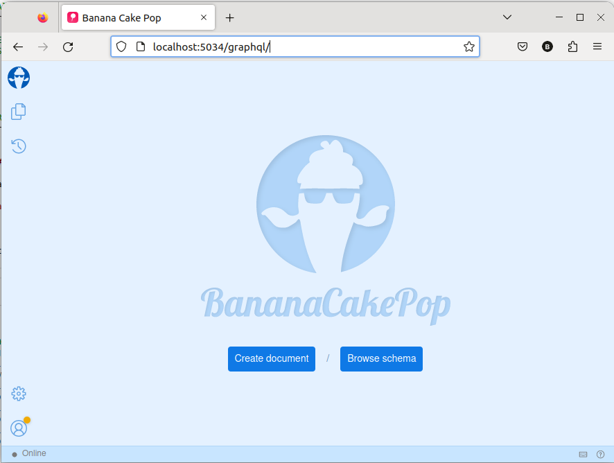
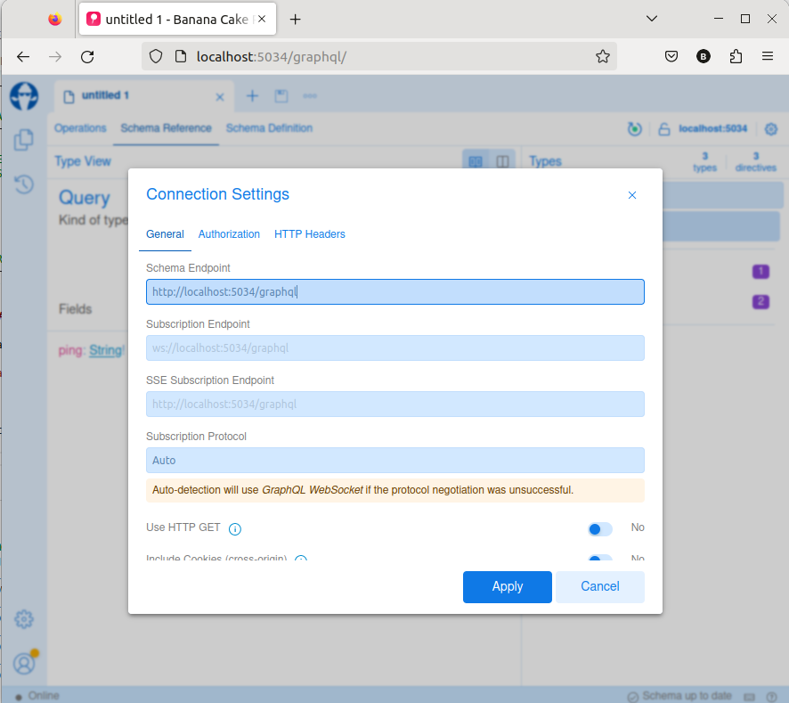
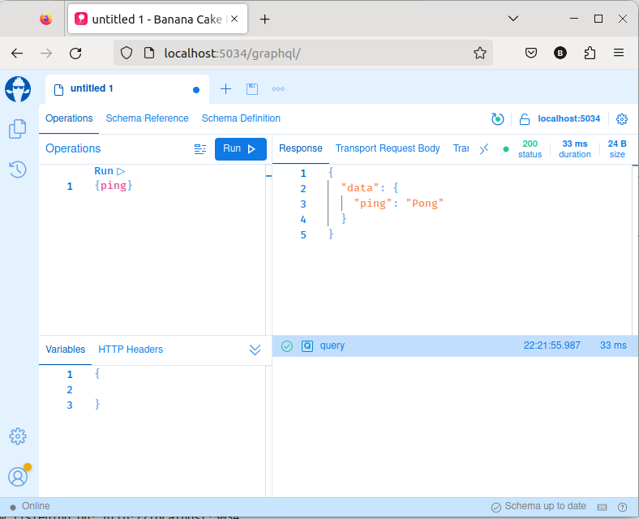
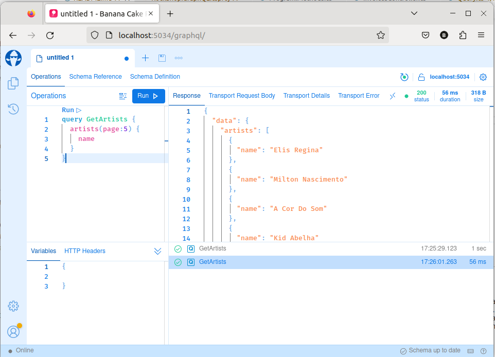
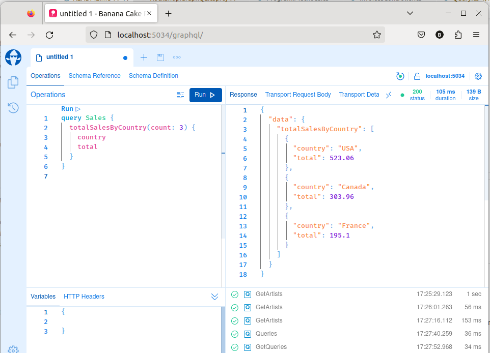
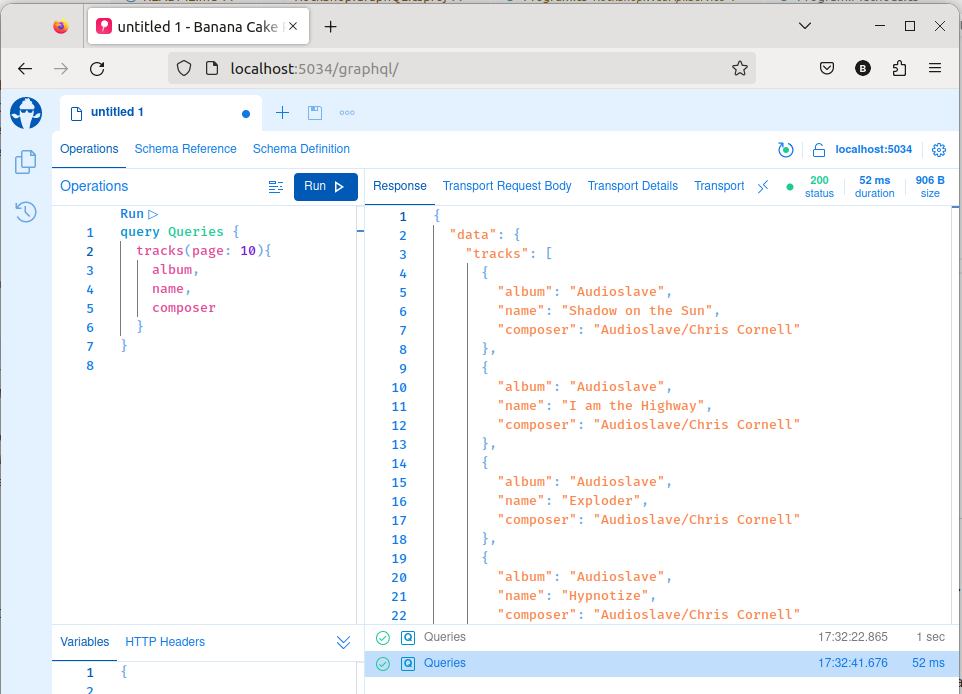
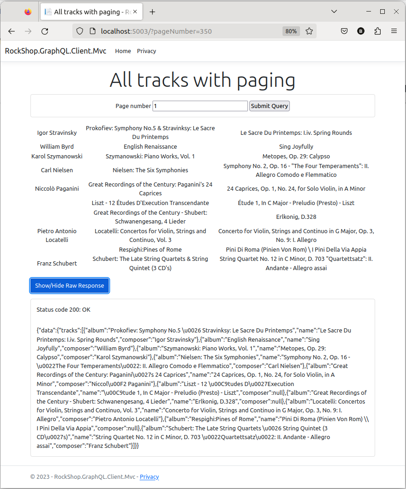
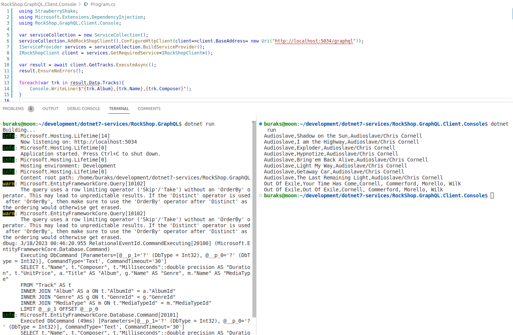
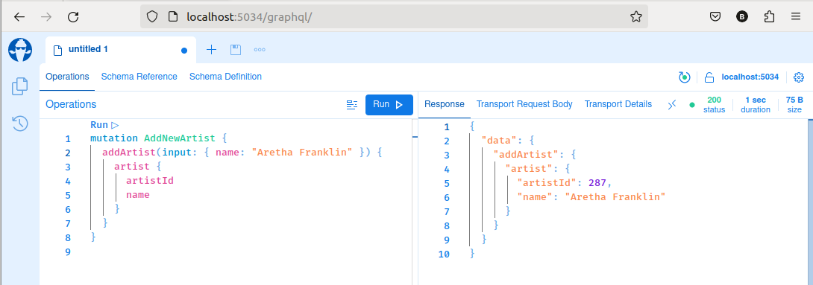

# .Net 7 App Services

In this repo, I include the codes that I try to examine the service development strategies on the .Net 7 side through a sample solution. Solution uses a simple and popular database, chinook. Database provider is Postgresql and reside on docker container.

## Some Useful Informations

```shell
# to use Postgresql
docker run --name postgresql -e POSTGRES_DB=chinook POSTGRES_USER=scoth -e POSTGRES_PASSWORD=tiger -p 5432:5432 -v /data:/var/lib/postgresql/data -d postgres

# to use ef tool
dotnet tool install -g dotnet-ef
# or update the existing dotnet-ef tool
dotnet tool update -g dotnet-ef

# create model classes from Chinook Db
# execute on RockShop.Common.Models project library
dotnet ef dbcontext scaffold "Host=localhost;Database=chinook;Username=scoth;Password=tiger" Npgsql.EntityFrameworkCore.Postgresql --namespace RockShop.Shared --data-annotations

# start existing container
docker start postgresql
# to working container list
docker ps -a
# to stop container
docker stop postgresql
# drop container
docker rm [container_id]

# if you want you can use docker-compose file
docker-compose up -d
```

## Run _(RockShop.WebApi)_

```bash
# to run
dotnet run

# to run with https profile
dotnet run --launch-profile https
```

### Sample Requests _(RockShop.WebApi)_

```bash
# Ping - Pong
curl -X 'GET' 'http://localhost:5221/ping' -H 'accept: text/plain'

# Get albums with paging
curl -X 'GET' 'http://localhost:5221/api/albums?page=5' -H 'accept: application/json'

# Get albums by artist name
curl -X 'GET' 'http://localhost:5221/api/albums/mfö' -H 'accept: application/json'

# Get artists with paging (You have to use Bearer Token for this request)
curl -X 'GET' 'http://localhost:5221/api/artists?page=10' -H 'accept: application/json'

# Get album by id
curl -X 'GET' 'http://localhost:5221/api/albums/45' -H 'accept: application/json'

# Get customers which living in Portugal
curl -X 'GET' 'http://localhost:5221/api/customers/Portugal' -H 'accept: application/json'

# Top * total sales by country
curl -X 'GET' 'http://localhost:5221/api/invoices/totalsales/top/5' -H 'accept: application/json'
curl -X 'GET' 'http://localhost:5221/api/invoices/totalsales/top/3' -H 'accept: application/json'
curl -X 'GET' 'http://localhost:5221/api/invoices/totalsales/top/-1' -H 'accept: application/json'

# Get Some Trucks informations with paging
curl -X 'GET' 'http://localhost:5221/api/tracks?page=25' -H 'accept: application/json'

# Add artist with albums
curl -X 'POST' \
  'http://localhost:5221/api/artists' \
  -H 'accept: application/json' \
  -H 'Content-Type: application/json' \
  -d '{
  "name": "MFÖ",
  "albums": [
    {
      "title": "Ele Gün Karşı Yapayalnız"
    },

    {
      "title": "Peki peki anladık"
    },
    {
      "title": "No Problem"
    },
    {
      "title": "Vak The Rock"
    },
    {
      "title": "Geldiler"
    },
    {
      "title": "M.V.A.B."
    }
  ]
}'

# Delete album with id
curl -X 'DELETE' 'http://localhost:5221/api/albums/1234' -H 'accept: */*'

# Update artist name
curl -X 'PUT' \
  'http://localhost:5221/api/artists/284' \
  -H 'accept: */*' \
  -H 'Content-Type: application/json' \
  -d '{
  "name": "Mazhar Fuat Özkan"
}'
```

Also we can use [Postman collection](Chinook%20Rest%20Service%20[Net%207].postman_collection.json) to test service endpoints.

### CORS Clients _(RockShop.WebApi)_

Use following steps to test CORS with clients.

- First of all start the **RockShop.WebApi.Service** project.
- Start **RockShop.WebApi.Client.MVC** project secondly.
- Then go to **http://localhost:5233 address** and search for some artists with Get Albums button.
- Also go to **http://localhost:5233/home/albums** address.

In all cases please look at browser debugger(by press F12)

### Rate Limiting Test _(With 3rd Party Package)_ _(RockShop.WebApi)_

You can use RockShop.WebApi.Client.Console project to test Rate Limitings. _(For any client id with decorate random guid, the rate limits is 2 request per 6 seconds)_ .For specific client test on client app use **"terminal-client-development"** value _(Just one call in 10 seconds)_ . In this case different rate limit policies applies which defined in appSettings for client app. Also we can use **"development-team"** for client identity. In this case rate limits does not apply to the client app.

**case 1 _(Client Id = Random)_**


**case 2 _(Client Id = development-team)_**


**case 3 _(Client Id = terminal-client-development)_**


### JWT Bearer Authorization _(RockShop.WebApi)_

The JWT Bearer token-based authorization system has also been added to the service application. Symbolically implemented only for Endpoint, which pulls Tracks information. Under normal circumstances, we need to prove ourselves to the system with an identity mechanism with a user name, password, fingerprint, etc. (Authentication). However, we can create a permanent token for developments in the local development environment with the user-jwts tool.

```bash
# In the RockShop.WebApi.Service project folder
dotnet user-jwts create

# Running this command generates a token. Token details can be seen using the ID information.
dotnet user-jwts print e5a9d922 --show-all
```


In addition, the Authentication tab is added to the appsettings.development.json file related to the generated token. This content contains valid authorization information for the Bearer token. Of course for testing purposes.

We get HTTP 401 Unauthorized Error for the following request.

```bash
curl -X 'GET' 'http://localhost:5221/api/tracks?page=1' -H 'accept: application/json'
```


For this reason we have to use Bearer Tokek on request.


## OData Sample

To test OData service we can use following commands.

```bash
# To get metadata
curl -X 'GET' 'http://localhost:5120/jukebox/$metadata' -H 'accept: application/json;odata.metadata=minimal;odata.streaming=true'

# Get album by id
curl -X 'GET' 'http://localhost:5120/jukebox/v1/Albums/1' -H 'accept: */*'

# Get all albums
curl -X 'GET' 'http://localhost:5120/jukebox/v1/Albums' -H 'accept: */*'

# Get total count of albums
curl -X 'GET' 'http://localhost:5120/jukebox/v1/Albums/$count' -H 'accept: */*'

# Get all artists
curl -X 'GET' 'http://localhost:5120/jukebox/v1/Artists' -H 'accept: */*'

# Get total count of artists
curl -X 'GET' 'http://localhost:5120/jukebox/v1/Artists/$count' -H 'accept: */*'

# Get specicif artist by id
curl -X 'GET' 'http://localhost:5120/jukebox/v1/Artists(16)' -H 'accept: */*'

# After version usage added
curl -X 'GET' 'http://localhost:5120/jukebox/v1/Tracks/12' -H 'accept: */*'
curl -X 'GET' 'http://localhost:5120/jukebox/v2/Tracks/12' -H 'accept: */*'

# OData services are usually built on querying resources. 
# However, it also allows operations such as Insert, Update, Delete.
# Sample Insert request
curl -X 'POST' \
  'http://localhost:5120/jukebox/v1/Artists' \
  -H 'accept: */*' \
  -H 'Content-Type: application/json;odata.metadata=minimal;odata.streaming=true' \
  -d '{
  "name": "Mazhar Fuat Özkan"
}'
# Sample Delete request for artist
curl -X 'DELETE' 'http://localhost:5120/jukebox/v1/Artists/287' -H 'accept: */*'
```

### OData Standard Query Materials

Query options; $select, $expand, $filter, $orderby, $skip, $top _([Grouping and Aggregation Support](https://learn.microsoft.com/en-us/odata/client/grouping-and-aggregation))_
Query parameters; eq, ne, lt, gt, le, ge, and, or, not, add, sub, mul, div, mod
Query functions; startswith, endswith, concat, contains, indexof, length, substring, tolower, toupper, trim, now, day, month, year, hour, minute, second

Some usages;

```bash
# Top 10 Album titles
curl -X 'GET' 'http://localhost:5120/jukebox/v1/albums/?$select=title&top=10' -H 'accept: */*'

# Top 10 Album titles but descending order
curl -X 'GET' 'http://localhost:5120/jukebox/v1/albums/?$orderby=title%20desc&$select=title&top=10' -H 'accept: */*'

# Albums which title starts with letter D
curl -X 'GET' 'http://localhost:5120/jukebox/v1/albums/?$filter=startswith(Title,%27D%27)&select=AlbumId,Title' -H 'accept: */*'

# EF runs the following query for the above OData query
# SELECT a."AlbumId", a."Title"
#      FROM "Album" AS a
#      WHERE @__TypedProperty_0 = '' OR ((a."Title" LIKE @__TypedProperty_0_1 || '%' ESCAPE '') 
#      AND left(a."Title", length(@__TypedProperty_0))::character varying(160) = @__TypedProperty_0::character varying(160))


# Returns a list of songs whose size is below a certain value.
curl -X 'GET' 'http://localhost:5120/jukebox/v1/tracks/?$filter=Bytes%20lt%201024000&$select=TrackId,Name,AlbumId,Bytes' -H 'accept: */*'

# Average Unit Price of All Tracks
curl -X 'GET' 'http://localhost:5120/jukebox/v1/Tracks?$apply=aggregate(UnitPrice%20with%20average%20as%20AverageUnitPrice)' -H 'accept: */*'

# Total Invoices group by Billing Country
curl -X 'GET' 'http://localhost:5120/jukebox/v1/Invoices?$apply=groupby((BillingCountry),aggregate(Total%20with%20sum%20as%20TotalAmount))' -H 'accept: */*'
```

### OData MVC Client Test

Start RockShop.OData.Service projcet first and than start the RockShop.OData.Client.Mvc project.


## GraphQL Sample

After the **dotnet run** command go to http://localhost:5034/graphql...





Sample Hello World graphql queries.

```json
query AreYouThere {
  ping
}

query GiveMeALuckNumber {
  luckyNum
}

query GetArtists {
  artists(page:5) {
    name
  }
}

query GetQueries {
  artists(page:5) {
    name
  },
  album(albumId:1){
    title
  }
}

query Sales {
  totalSalesByCountry(count: 3) {
    country
    total
  }
}

query Queries {
  tracks(page: 10){
    album,
    name,
    composer
  }
}
```










### MVC Client Test for GraphQL

Start RockShop.GraphQL projcet first and than start the RockShop.GraphQL.Client.Mvc project.



### Console Client for GraphQL

In this sample we use Strawberry Shake tool which creating graphql client easly.

```bash
# in console application folder
dotnet new tool-manifest
dotnet tool install StrawberryShake.Tools --local

# After added required packages start the GraphQL server and than
# This command adds a GraphQL client to Console application. Look at the files which has a .graphql extensions.
dotnet graphql init http://localhost:5034/graphql -n RockShopClient
```



### GraphQL Mutations

Sample insert message.

```json
mutation AddNewArtist {
  addArtist(input: { name: "Aretha Franklin" }) {
    artist {
      artistId
      name
    }
  }
}

// For Check (Album ID different probably)
query FindArtist{
  artist(artistId: 287){
    name
  }
}
```

